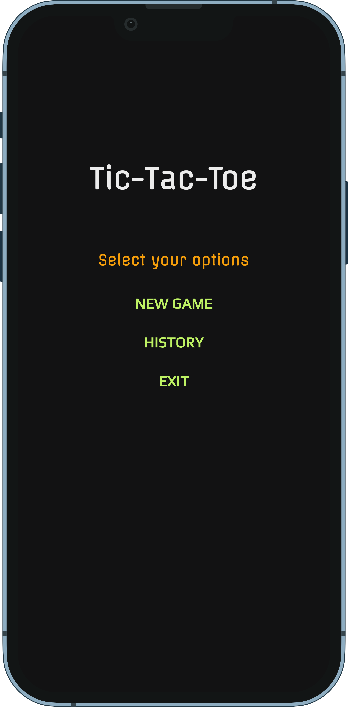
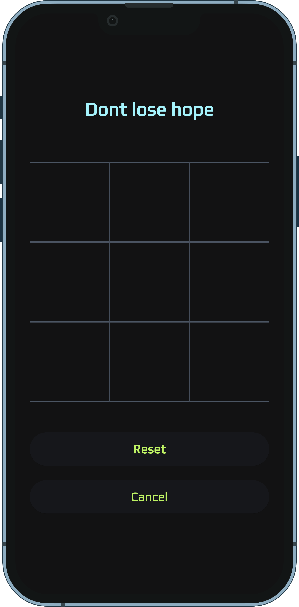
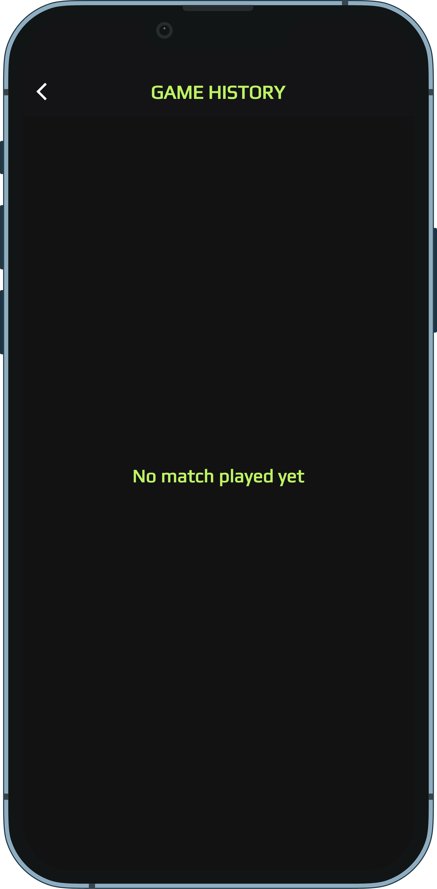
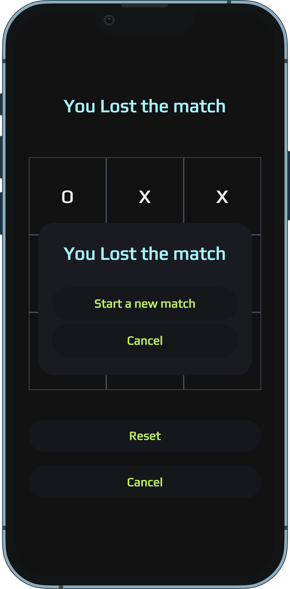
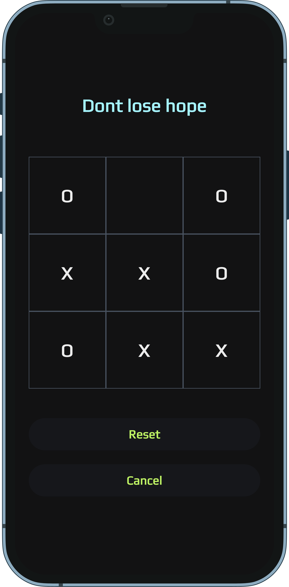
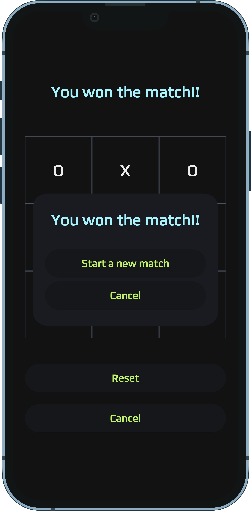
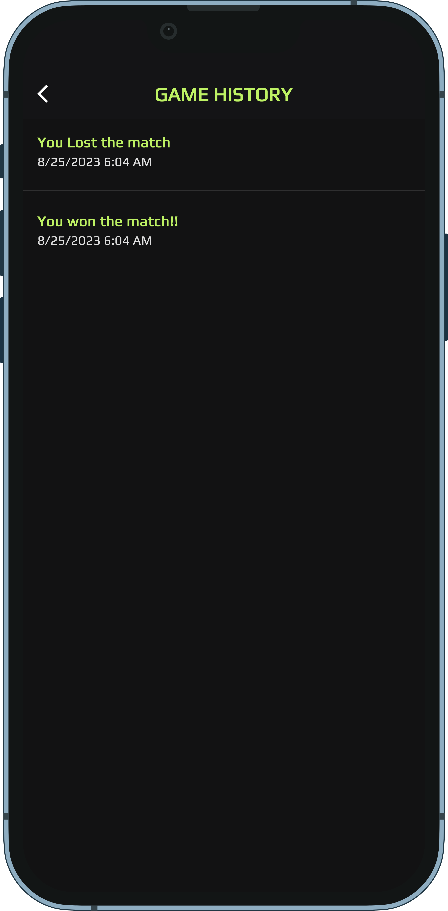

# Tic Tac Toe Flutter App
[](https://github.com/Shreemanarjun/tic_tac_toe/actions)
[](https://codecov.io/gh/Shreemanarjun/tic_tac_toe)
[](https://github.com/Shreemanarjun/tic_tac_toe/releases)
[](https://opensource.org/licenses/MIT)
[](https://flutter.dev)


https://github.com/Shreemanarjun/tic_tac_toe/assets/24736211/3a6ff812-b227-4b40-a9ee-30adfffbfd71


<!--  -->


Welcome to the Tic Tac Toe Flutter App! 🎮 Play the classic game of Tic Tac Toe with a modern and user-friendly UI. This app supports persistent storage of game progress, allows you to view the game history, and offers both a light and dark mode for your gaming pleasure. 

## Features

- Play Tic Tac Toe with a friend on the same device.
- Persistent storage of game progress ensures you can continue games even if you close the app.
- View the history of all your played games and outcomes.
- Enjoy an easy-to-use modern UI with intuitive controls.
- Switch between light and dark modes to suit your preference.
- Interactive emoji-based game elements add fun to your gameplay.

## Screenshots


<p float="left" style="display: flex; justify-content: space-between margin-right: 16px margin-left: 16px;">
     
     
     
  
  
  
</p>
<p float="left" style="display: flex; justify-content: space-between margin-right: 8px margin-left:8px">

     
     
      
      
</p>


## How to Run

Follow these steps to run the Tic Tac Toe Flutter App on your local machine:

1. **Prerequisites**: Make sure you have Flutter and Dart installed on your machine. If not, you can follow the instructions [here](https://flutter.dev/docs/get-started/install) to install Flutter.

2. **Clone Repository**: Clone this repository to your local machine using the following command:

   ```
   git clone https://github.com/Shreemanarjun/tic_tac_toe.git
   ```

3. **Navigate to Project Directory**: Change your current directory to the project directory:

   ```
   cd tic_tac_toe
   ```

4. **Install Dependencies**: Install the app's dependencies by running:

   ```
   flutter pub get
   ```

5. **Run the App**: Launch the app on an emulator or a connected device using:

   ```
   flutter run
   ```

6. **Play the Game**: Once the app is running, you can start playing Tic Tac Toe with a friend. Use the on-screen buttons to make your moves, and enjoy the game!

## Contributions

Contributions are welcome! If you find any bugs or have suggestions for improvements, feel free to open an issue or submit a pull request. Let's make this app even better together! 🚀

## License

This project is licensed under the [MIT License](LICENSE).

---

Thank you for checking out the Tic Tac Toe Flutter App. Have fun playing and may the best player win! If you have any questions or need assistance, feel free to contact us at [shreemanarjunsahu@gmail.com](mailto:shreemanarjunsahu@gmail.com).

_Keep tic-tac-toeing!_ 🤖🔴🟢
